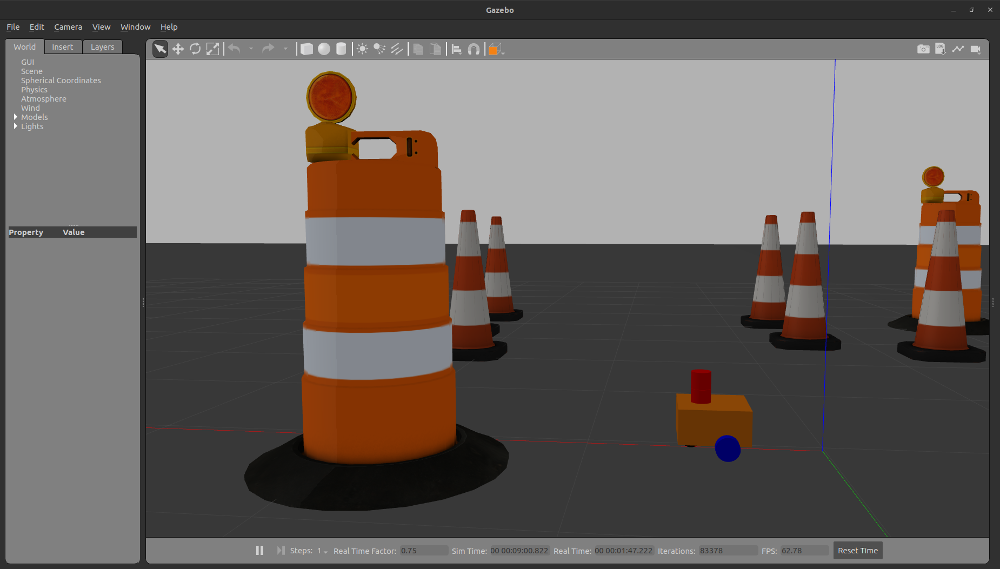
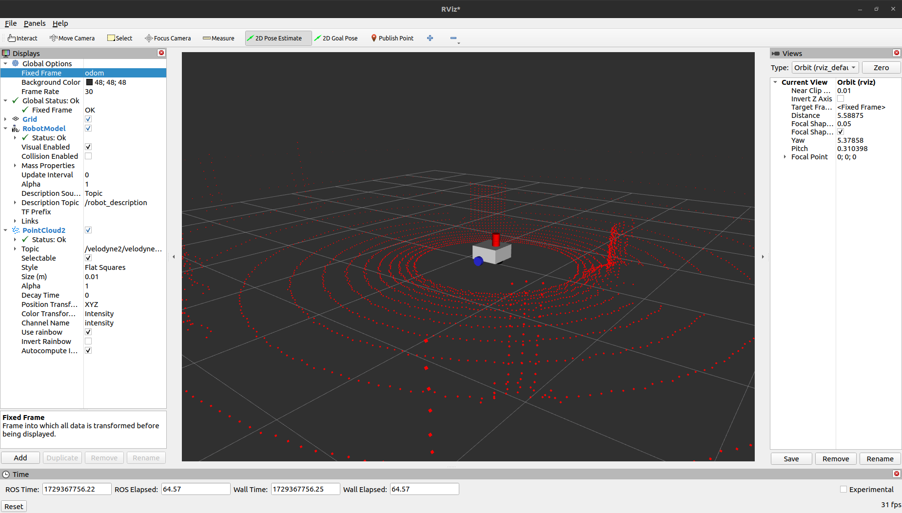

# ROS2 Mobile Robot using 3D LiDAR in Gazebo Simulation

Simulate a mobile robot equipped with a 3D LiDAR sensor in Gazebo Classic, using ROS2 for seamless integration. This project allows the robot to navigate a simulated environment while capturing detailed 3D point cloud data, which can be visualized in real-time using RViz.





## Prerequisites

- ROS2 Humble (tested)
- Gazebo Classic (tested)
- Should also work with ROS2 Foxy

## Installation and Setup

1. **Source ROS2 environment:**
   ```bash
   source /opt/ros/humble/setup.bash
   ```

2. **Create a ROS2 workspace:**
   ```bash
   mkdir -p ~/ros2_ws/src
   cd ~/ros2_ws/src
   ```

3. **Clone the necessary repositories:**
   ```bash
   git clone https://github.com/louislelay/mobile-3d-lidar-sim.git
   git clone https://bitbucket.org/DataspeedInc/velodyne_simulator.git
   cd velodyne_simulator
   git checkout foxy-devel
   ```

4. **Build the workspace:**
   ```bash
   cd ~/ros2_ws
   colcon build
   ```

5. **Source the workspace setup file:**
   ```bash
   source install/setup.bash
   ```

## Running the Simulation

1. **Launch the robot in Gazebo:**

   To run the default simulation:
   ```bash
   ros2 launch my_bot launch_sim.launch.py
   ```

   To run the simulation in a custom world:
   ```bash
   ros2 launch my_bot launch_sim.launch.py world:=./src/mobile-3d-lidar-sim/my_bot/worlds/obstacles.world
   ```

2. **Control the robot:**

   In a new terminal, run the following to control the robot using your keyboard:
   ```bash
   ros2 run teleop_twist_keyboard teleop_twist_keyboard
   ```

3. **Visualize the simulation in RViz:**

   In a third terminal, run:
   ```bash
   rviz2
   ```

   - **Add visualization elements:**
     - Add a `RobotModel`.
     - Add a `PointCloud2`.

   - **Configure visualization:**
     - In `Global Options`, change `Fixed Frame` to `odom`.
     - In `RobotModel`, change the `Description Topic` to `/robot_description`.
     - In `PointCloud2`, change the `Topic` to `/velodyne2/velodyne_points2`.

## Additional Information

This project simulates a mobile robot equipped with a Velodyne 3D LiDAR, offering a complete setup for testing sensor data processing and visualization using ROS2 and Gazebo Classic. The robot can be controlled using teleoperation, and all data can be visualized in RViz for easy analysis.
